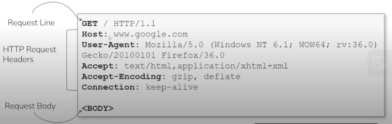
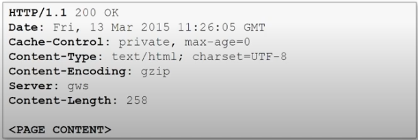

# HTTP

<table><thead><tr><th width="123"></th><th>HTTP 1.0</th><th>HTTP 1.1</th><th>HTTP 2.0</th></tr></thead><tbody><tr><td>Tipo di connessione</td><td>Ogni richiesta si apre e chiude una nuova connessione TCP.</td><td>Più richieste/risposte per ogni connessione.</td><td>Più richieste in parallelo per ogni connessione.</td></tr><tr><td>Header</td><td>Inviati ad ogni richiesta. Non compressi.</td><td>Inviati ad ogni richiesta. Non compressi.</td><td>Compressi (HPACK)</td></tr><tr><td>Tipo</td><td>Stateless</td><td>Stateless</td><td>Stateless</td></tr></tbody></table>

***

## <mark style="color:$primary;">HTTP Request</mark>

<figure><figcaption></figcaption></figure>

<p align="center"><code>HTTP_method URL HTTP_version</code></p>

* HTTP Method: GET, POST, PUT, DELETE, PATCH, HEAD, OPTIONS
* URL
* HTTP version

***

### <mark style="color:$primary;">HTTP Req Headers</mark>

* User-agent: info sul client che fa la req (e.g. browser type, device type)
* Host: hostname del server
* Accept: tipi che il client può gestire nella risposta (e.g. html, json)
* Authorization: creds per l'auth
* Cookie: info stored nel client da reinviare al server ad ogni req

***

### <mark style="color:$primary;">HTTP Body</mark>

* Dati inviati&#x20;

***

## <mark style="color:$primary;">HTTP Response</mark>

<figure><figcaption></figcaption></figure>

<table><thead><tr><th width="125">Status code</th><th width="207.00006103515625">Meaning del status code</th><th width="409.99993896484375">Meaning</th></tr></thead><tbody><tr><td>200</td><td>OK</td><td>Successo. Dati arrivati.</td></tr><tr><td>301</td><td>Moved Permanently</td><td>Spostato permanentemente ad un altro URL.</td></tr><tr><td>302</td><td>Found</td><td>Spostato temporaneamente ad un altro URL.</td></tr><tr><td>400</td><td>Bad Request</td><td>Client error</td></tr><tr><td>401</td><td>Unauthorized</td><td>Accesso non autorizzato. Dai creds.</td></tr><tr><td>403</td><td>Forbidden</td><td>Accesso non autorizzato.</td></tr><tr><td>404</td><td>Not found</td><td>Risorsa non trovata</td></tr><tr><td>500</td><td>Internal Server Error</td><td>Server error</td></tr></tbody></table>

***

### <mark style="color:$primary;">HTTP Resp Headers</mark>

* Date: quando il server ha generato la risposta
* Cache-Control: info per fare caching (e.g. private, public, no-cache, no-store, max-age=\<SEC>)
* Content-type: il tipo del contenuto della risposta (e.g. text/html, app/json)
* Server: tipo di server (e.g. apache, nginx, gws)
* Content-length: size del response body in bytes
* Set-Cookie: setta i cookie nel client per request successive


## <mark style="color:$primary;">Wireshark</mark>

```shell
wireshark -i <INTERFACE>             #e.g. eth1
#Seleziona eth1

#THREE WAY-HANDSHAKE
#1. SYN         client - invia packet con SYN flag set
#2. SYN-ACK     server - riceve il packet e risponde con un packet che ha SYN e ACK
#3. ACK         client - accetta e reinvia un packet con la flag ACK
#4. GET HTTP    client - chiede info sul sito
#5. ACK         server - richiesta ricevuta
#Per chiudere la comunicazione RST o FIN

#File -> Export Objects -> HTTP -> scegli cosa esportare e metti Save per averli in locale
```

## ------------------------

## <mark style="color:$primary;">HTTPS</mark>


HTTPS = HTTP + SSL/TLS

XXS e SQLi continuano a funzionare. Semplicemente la comunicazione è encrypted.



