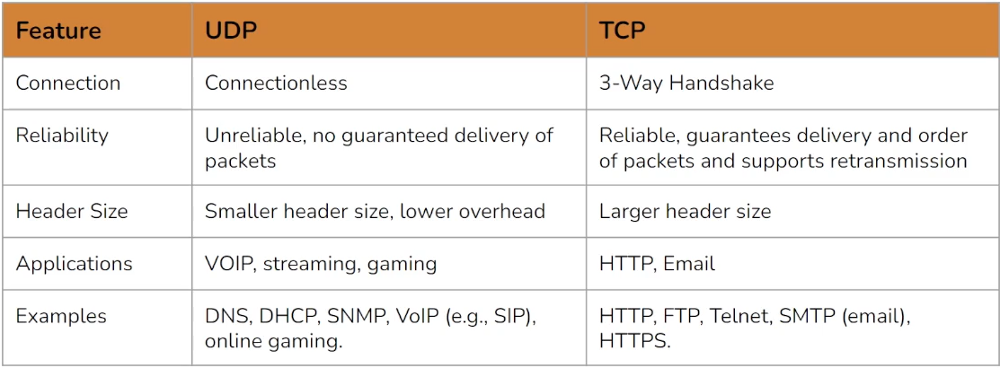

# Network fundamentals

## Well-known Ports

| Port  | Service |
| ----- | ------- |
| 21    | FTP     |
| 22    | SSH     |
| 25    | SMTP    |
| 80    | HTTP    |
| 110   | POP3    |
| 443   | HTTPS   |
| 3306  | MySQL   |
| 3389  | RDP     |
| 8080  | HTTP    |
| 27017 | MongoDB |

## ISO-OSI

<figure><picture><source srcset="../.gitbook/assets/image (2).png" media="(prefers-color-scheme: dark)"></picture><figcaption></figcaption></figure>

### <mark style="color:$primary;">Transport Layer (lvl 4)</mark>

Assicura una comunicazione end-to-end affidabile fra due device in un network gestendo errori, controllando il flow e segmentando i dati in pacchetti più piccoli.&#x20;

Obiettivo: facilitare la comunicazione fra due device nello stesso network.

Protocolli:&#x20;

* TCP:&#x20;
  * connection protocol (tramite il three-way handshake crea una connessione fra src e dest prima di ogni comunicazione)
  * affidabile (con l'ACK è sicuro che il pacchetto sia stato ricevuto)
  * packets ordinati (se i frammenti arrivano nell'ordine errato li riassembla prima di darli al layer 5). &#x20;
*   UDP:&#x20;

    * connectionless protocol (nessun three-way handshake e nessuna connessione).
    * stateless protocol (non ha nessuna info sulla comunicazione)
    * ogni packet è indipendente (non vi è correlazione con gli altri)
    * semplicità, efficienza azioni non affidabili e non ordinate dei pacchetti, veloce).

    <figure><figcaption></figcaption></figure>

### <mark style="color:$primary;">Network Layer (lvl 3)</mark>

Responsabile per il logical addressing, routing e forwarding dei packets fra network diversi.&#x20;

Obiettivo: Trovare il path migliore fra device in network diversi.&#x20;

Protocolli:&#x20;

* IP: responsabile per addressing, routing e fragmentation/riassembly dei pacchetti
* ICMP: usato per riportare errori e diagnostica. Include anche il ping, tracert.&#x20;
* DHCP: assegna dinamicamente e automaticamente IP a nuovi device evitando collisioni fra IP.&#x20;
* IPSec


## <mark style="color:$primary;">EXTRA</mark>

### Vedi TCP conn open

Per vedere se ci sono connessioni TCP aperte &#x20;

```bash
netstat -antp
```

### Three-way handshake

<figure><figcaption></figcaption></figure>
